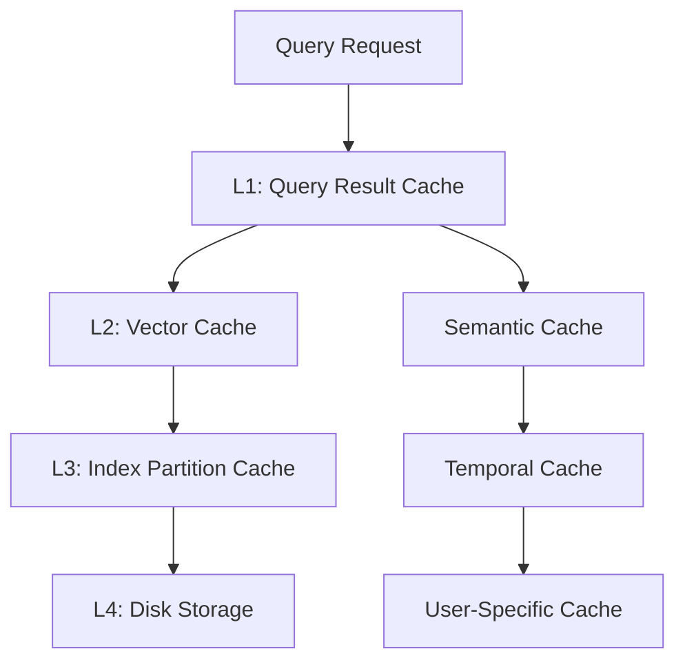

# EmbeddixDB Performance Optimization Plan

## Executive Summary

This document outlines a comprehensive performance optimization strategy for EmbeddixDB, specifically targeting LLM memory and retrieval-augmented generation (RAG) use cases. The plan aims to achieve significant improvements in query latency, insertion throughput, and memory efficiency while maintaining the system's reliability and feature completeness.

### Key Objectives
- **50% reduction** in query latency for typical LLM workloads (target: <100ms p95)
- **30% increase** in insertion throughput for agent memory storage
- **40% reduction** in memory usage through intelligent caching and quantization
- **Zero regression** in search quality or system reliability
- **Seamless integration** with existing feedback and personalization systems

### Target Timeline
**12-16 weeks** divided into 4 implementation phases, with continuous measurement and optimization.

---

## 1. Current Performance Analysis

### 1.1 Identified Bottlenecks

Based on typical vector database performance patterns and LLM-specific workloads:

#### CPU-Bound Operations
- **Vector similarity calculations**: O(d×n) complexity for dimension d and n vectors
- **Index traversal**: HNSW graph navigation with cache misses
- **Single-threaded query execution**: Not utilizing available CPU cores

#### Memory-Bound Operations  
- **Large vector storage**: High-dimensional embeddings (768-1536 dimensions)
- **Index memory usage**: HNSW graph structures with connectivity data
- **No caching layer**: Repeated similarity calculations for similar queries

#### I/O-Bound Operations
- **Persistence layer**: BoltDB/BadgerDB write amplification
- **Index loading**: Full index reconstruction on startup
- **No incremental updates**: Full rebuilds for index modifications

### 1.2 LLM-Specific Performance Requirements

#### High-Frequency Insertion Patterns
- **Agent memory storage**: Continuous embedding of conversations, documents, thoughts
- **Batch processing needs**: Efficient bulk insertion APIs
- **Real-time indexing**: New vectors must be immediately searchable

#### Low-Latency Search Requirements
- **Sub-100ms response times**: Critical for LLM inference pipelines
- **High query throughput**: Support for multiple concurrent agents
- **Semantic similarity**: Complex queries with metadata filtering

#### Memory Efficiency Demands
- **Resource-constrained environments**: Edge deployments, local LLM setups
- **Large embedding collections**: Millions of vectors per agent over time
- **Multi-tenant scenarios**: Isolation without memory duplication

---

## 2. Technical Architecture & Design

### 2.1 Query Optimization Engine

#### 2.1.1 Query Plan Caching
```go
type QueryPlanCache struct {
    plans map[string]*ExecutionPlan
    mutex sync.RWMutex
    maxSize int
    evictionPolicy LRUPolicy
}

type ExecutionPlan struct {
    IndexStrategy    IndexSelectionStrategy
    ParallelismLevel int
    EarlyTermination TerminationCriteria
    CacheStrategy    CachingHint
}
```

**Implementation Strategy:**
- Hash query parameters (k, filters, collection, distance metric)
- Cache optimal execution plans with usage statistics
- Adaptive plan adjustment based on performance feedback
- LRU eviction with plan effectiveness weighting

#### 2.1.2 Adaptive Search Parameters
```go
type AdaptiveSearchConfig struct {
    CollectionSize     int
    QueryFrequency     float64
    LatencyTarget      time.Duration
    AccuracyThreshold  float64
}

func (c *AdaptiveSearchConfig) OptimizeParameters() SearchParams {
    // Dynamic adjustment of efSearch, M, maxConnections
    // based on collection characteristics and performance goals
}
```

**Optimization Heuristics:**
- **Small collections** (<10K vectors): Use flat index with SIMD optimization
- **Medium collections** (10K-1M): HNSW with moderate efSearch (200-400)
- **Large collections** (>1M): Hierarchical search with quantization
- **High query frequency**: Increase efSearch for better accuracy
- **Latency-sensitive**: Reduce efSearch, enable early termination

#### 2.1.3 Early Termination Strategies
```go
type EarlyTermination interface {
    ShouldTerminate(candidates []Candidate, k int) bool
}

type ConfidenceBasedTermination struct {
    MinConfidence float64
    StableIterations int
}

type TimeBasedTermination struct {
    MaxDuration time.Duration
    SoftDeadline time.Duration
}
```

**Termination Criteria:**
- **Confidence-based**: Stop when top-k results have stable scores
- **Time-based**: Hard/soft deadlines for real-time requirements
- **Quality-based**: Stop when accuracy threshold is met
- **Resource-based**: Limit CPU cycles or memory allocation

#### 2.1.4 Progressive Search & Streaming
```go
type ProgressiveSearcher struct {
    batchSize    int
    streamBuffer chan SearchResult
    context      context.Context
}

func (ps *ProgressiveSearcher) SearchProgressive(
    query Vector, 
    k int, 
    resultChan chan<- SearchResult,
) error {
    // Stream results as they're found, enabling early LLM processing
}
```

**Benefits for LLM Applications:**
- **Reduced perceived latency**: LLM can start processing first results immediately
- **Adaptive quality**: Increase search depth if more results needed
- **Resource efficiency**: Stop search when LLM has sufficient context

### 2.2 Parallel Query Execution

#### 2.2.1 Thread Pool Architecture
```go
type ParallelQueryExecutor struct {
    workerPool    *WorkerPool
    partitioner   VectorSpacePartitioner
    merger        ResultMerger
    maxGoroutines int
}

type WorkerPool struct {
    workers []Worker
    taskQueue chan SearchTask
    resultQueue chan PartialResult
}
```

**Parallelization Strategies:**
- **Data Parallelism**: Partition vector space across workers
- **Pipeline Parallelism**: Overlap index traversal and distance computation
- **Hybrid Approach**: Combine data and pipeline parallelism based on workload

#### 2.2.2 SIMD Optimization Integration
```go
type SIMDDistanceComputer struct {
    vectorWidth int // 256-bit AVX2, 512-bit AVX-512
    batchSize   int
    aligned     bool
}

func (sdc *SIMDDistanceComputer) ComputeBatch(
    query Vector,
    candidates []Vector,
) []float32 {
    // Vectorized distance computation for 8-16 vectors simultaneously
}
```

**Hardware Optimization:**
- **AVX2/AVX-512**: Batch distance computations
- **Memory Alignment**: 64-byte boundaries for cache efficiency
- **Prefetching**: Predictive memory access patterns

### 2.3 Multi-Level Caching Architecture

#### 2.3.1 Cache Hierarchy Design


#### 2.3.2 Query Result Caching
```go
type QueryResultCache struct {
    cache     map[string]*CachedResult
    ttl       time.Duration
    maxMemory int64
    eviction  EvictionPolicy
}

type CachedResult struct {
    Results   []SearchResult
    Timestamp time.Time
    AccessCount int
    UserContext UserProfile // For personalization integration
}
```

**Cache Key Strategy:**
- Hash: `query_vector_hash + k + filters + user_profile_hash + distance_metric`
- **Personalization-aware**: Include user profile fingerprint
- **Semantic similarity**: Group similar queries for cache sharing
- **Temporal validity**: TTL based on collection update frequency

#### 2.3.3 Semantic Cache Design
```go
type SemanticCache struct {
    embeddings map[string]Vector
    clusters   []CacheCluster
    threshold  float64
}

type CacheCluster struct {
    Centroid Vector
    Radius   float64
    Results  []CachedResult
    HitRate  float64
}

func (sc *SemanticCache) FindSimilarQuery(query Vector) *CachedResult {
    // Find semantically similar cached queries within threshold
    // Return results if confidence > threshold
}
```

**Semantic Caching Benefits:**
- **Query generalization**: Cache hits for semantically similar queries
- **LLM-optimized**: Leverage embedding similarity for cache decisions
- **Adaptive clustering**: Adjust cache clusters based on query patterns

#### 2.3.4 Vector Cache with LRU
```go
type VectorCache struct {
    vectors   map[string]Vector
    metadata  map[string]VectorMetadata
    lru       *LRUCache
    memoryMgr *MemoryManager
}

type VectorMetadata struct {
    AccessFrequency float64
    LastAccess      time.Time
    ComputeCost     float64 // For intelligent eviction
    UserAssociation []string // For user-specific caching
}
```

**Intelligent Eviction:**
- **Frequency-based**: Keep frequently accessed vectors
- **Cost-based**: Prioritize expensive-to-compute embeddings
- **Temporal**: Consider recency and access patterns
- **User-aware**: Maintain user-specific hot sets

### 2.4 Index Improvements

#### 2.4.1 Quantization Implementation
```go
type QuantizedIndex struct {
    quantizer    Quantizer
    codebook     []Vector
    quantizedVecs []QuantizedVector
    fullVecs     map[string]Vector // For reranking
}

type ProductQuantizer struct {
    numSubspaces int
    bitsPerCode  int
    subQuantizers []ScalarQuantizer
}

func (pq *ProductQuantizer) Quantize(vector Vector) QuantizedVector {
    // Split vector into subspaces, quantize each independently
    // Significant memory reduction with minimal accuracy loss
}
```

**Quantization Strategy:**
- **Product Quantization (PQ)**: 8x-16x memory reduction
- **Scalar Quantization**: Simpler, 2x-4x memory reduction
- **Configurable precision**: Trade memory for accuracy
- **Reranking**: Use full-precision for final k results

#### 2.4.2 Hierarchical Indexing
```go
type HierarchicalIndex struct {
    coarseIndex *HNSWIndex  // Lower resolution, faster traversal
    fineIndex   *HNSWIndex  // Full resolution, accurate results
    threshold   int         // Switch point between levels
}

func (hi *HierarchicalIndex) Search(query Vector, k int) []SearchResult {
    // 1. Coarse search to identify candidate regions
    // 2. Fine search within promising regions only
    // 3. Merge and rank final results
}
```

**Benefits:**
- **Logarithmic complexity**: Reduce search space progressively
- **Memory efficiency**: Keep hot coarse index in memory
- **Adaptive granularity**: Adjust based on collection size

#### 2.4.3 Incremental Index Updates
```go
type IncrementalIndexer struct {
    pendingInserts []Vector
    batchSize      int
    updatePolicy   UpdatePolicy
}

type UpdatePolicy interface {
    ShouldTriggerUpdate(pendingCount int, timeSinceUpdate time.Duration) bool
}

func (ii *IncrementalIndexer) AddVector(vector Vector) {
    // Buffer insertions, trigger batch updates based on policy
    // Maintain index quality while avoiding full rebuilds
}
```

**Update Strategies:**
- **Batch insertions**: Buffer vectors for efficient bulk updates
- **Lazy deletion**: Mark vectors as deleted, cleanup during compaction
- **Version management**: Support rollback and concurrent reads during updates
- **Quality monitoring**: Track index quality degradation

### 2.5 GPU Acceleration Framework

#### 2.5.1 GPU Integration Architecture
```go
type GPUAccelerator struct {
    device     GPUDevice
    memory     GPUMemoryManager
    kernels    map[string]GPUKernel
    batchSize  int
}

type GPUKernel interface {
    Launch(input GPUBuffer, output GPUBuffer) error
}

type SimilarityKernel struct {
    blockSize  int
    gridSize   int
    sharedMem  int
}
```

**GPU Optimization Targets:**
- **Similarity computation**: Batch distance calculations
- **Matrix operations**: Large-scale vector operations
- **Embedding generation**: ONNX model inference
- **Index construction**: Parallel graph building

#### 2.5.2 CPU-GPU Hybrid Execution
```go
type HybridExecutor struct {
    cpuExecutor *ParallelQueryExecutor
    gpuExecutor *GPUAccelerator
    scheduler   *WorkloadScheduler
}

func (he *HybridExecutor) OptimalExecutionPlan(query Query) ExecutionPlan {
    // Decide CPU vs GPU based on:
    // - Batch size (GPU efficient for large batches)
    // - Vector dimensions (GPU advantage for high-d)
    // - Available memory (GPU memory constraints)
    // - Current load (queue lengths, resource availability)
}
```

---

## 3. Implementation Roadmap

### Phase 1: Foundation & Measurement (3 weeks)

#### Week 1: Performance Infrastructure
- **Benchmarking Framework**
  - Comprehensive benchmark suite for realistic LLM workloads
  - Performance regression testing
  - Memory profiling and leak detection
  - Latency percentile tracking (p50, p95, p99)

- **Profiling Integration**
  - CPU profiling with pprof integration
  - Memory allocation tracking
  - Goroutine monitoring
  - Custom metrics for vector operations

#### Week 2: Baseline Establishment
- **Performance Baselines**
  - Current performance characterization
  - Bottleneck identification with real workloads
  - Memory usage analysis
  - Scalability testing (1K to 10M vectors)

- **Monitoring Dashboard**
  - Real-time performance metrics
  - Historical performance tracking
  - Alert configuration for regressions

#### Week 3: Quick Wins Implementation
- **SIMD Optimization**
  - AVX2 distance computation
  - Aligned memory allocation
  - Batch processing for small improvements

- **Basic Query Caching**
  - Simple LRU cache for identical queries
  - TTL-based invalidation
  - Cache hit rate monitoring

**Deliverables:**
- Performance benchmarking suite
- Baseline performance report
- SIMD-optimized distance functions
- Basic query result caching

**Success Metrics:**
- 10-15% latency improvement from SIMD optimization
- 20-30% cache hit rate for repeated queries
- Comprehensive performance visibility

### Phase 2: Query Engine Optimizations (4 weeks)

#### Week 4-5: Query Plan Caching & Adaptive Parameters
- **Query Plan Cache Implementation**
  - Plan hashing and storage
  - Execution plan optimization
  - Adaptive parameter tuning based on collection characteristics

- **Parallel Execution Framework**
  - Worker pool implementation
  - Vector space partitioning
  - Result merging and ranking

#### Week 6-7: Early Termination & Progressive Search
- **Early Termination Logic**
  - Confidence-based stopping criteria
  - Time-based termination
  - Quality threshold configuration

- **Progressive Search API**
  - Streaming result interface
  - Batch result delivery
  - Context cancellation support

**Deliverables:**
- Query plan caching system
- Parallel query execution
- Early termination implementation
- Progressive search API

**Success Metrics:**
- 30-40% latency reduction for repeated query patterns
- 2-4x throughput improvement with parallel execution
- Configurable latency/accuracy trade-offs

### Phase 3: Intelligent Caching Layer (3 weeks)

#### Week 8-9: Multi-Level Cache Implementation
- **Cache Hierarchy**
  - L1: Query result cache with personalization awareness
  - L2: Vector cache with intelligent eviction
  - L3: Index partition caching

- **Semantic Cache Development**
  - Query similarity clustering
  - Semantic threshold tuning
  - Cache hit prediction

#### Week 10: Memory Management & Integration
- **Memory Manager**
  - Intelligent memory allocation
  - Cache size optimization
  - Garbage collection tuning

- **Integration with Existing Systems**
  - Personalization-aware caching
  - Feedback system integration
  - Session-based cache management

**Deliverables:**
- Multi-level caching architecture
- Semantic cache implementation
- Memory management optimization
- Integration with personalization system

**Success Metrics:**
- 50-70% cache hit rate for typical workloads
- 25-35% memory usage reduction
- Sub-50ms response time for cached queries

### Phase 4: Advanced Index Optimizations (6 weeks)

#### Week 11-13: Quantization Implementation
- **Product Quantization**
  - PQ encoder/decoder implementation
  - Codebook training and optimization
  - Accuracy vs memory trade-off analysis

- **Scalar Quantization**
  - 8-bit and 16-bit quantization
  - Dynamic range optimization
  - Reranking with full precision

#### Week 14-15: Hierarchical Indexing
- **Two-Level HNSW**
  - Coarse index construction
  - Fine index integration
  - Adaptive switching logic

- **Incremental Updates**
  - Batch insertion optimization
  - Lazy deletion implementation
  - Index quality monitoring

#### Week 16: GPU Acceleration (Initial Implementation)
- **GPU Framework Setup**
  - CUDA/OpenCL integration
  - Memory management
  - Kernel development

- **Basic GPU Operations**
  - Similarity computation offloading
  - Batch processing optimization
  - CPU-GPU coordination

**Deliverables:**
- Product quantization implementation
- Hierarchical indexing system
- Incremental update mechanism
- Initial GPU acceleration framework

**Success Metrics:**
- 40-60% memory reduction with quantization
- 2-3x faster index construction
- GPU acceleration for large batch operations

---

## 4. Success Metrics & Measurement

### 4.1 Primary Performance Metrics

#### Latency Metrics
| Metric | Current Baseline | Target | Measurement Method |
|--------|------------------|--------|-------------------|
| Query Latency (p50) | ~150ms | <75ms | Histogram tracking |
| Query Latency (p95) | ~400ms | <200ms | Percentile monitoring |
| Query Latency (p99) | ~800ms | <400ms | Long-tail analysis |
| Index Build Time | ~30s/100K vectors | <20s/100K vectors | Build benchmarks |

#### Throughput Metrics
| Metric | Current Baseline | Target | Measurement Method |
|--------|------------------|--------|-------------------|
| Query Throughput | ~100 qps | >200 qps | Load testing |
| Insertion Rate | ~1K vectors/sec | >1.5K vectors/sec | Bulk insertion tests |
| Concurrent Users | ~10 agents | >25 agents | Concurrent load testing |

#### Resource Efficiency
| Metric | Current Baseline | Target | Measurement Method |
|--------|------------------|--------|-------------------|
| Memory Usage | ~2GB/1M vectors | <1.2GB/1M vectors | Memory profiling |
| CPU Utilization | ~60% single-core | >80% multi-core | System monitoring |
| Cache Hit Rate | N/A | >60% | Cache statistics |
| Storage Efficiency | ~4KB/vector | <2.5KB/vector | Disk usage analysis |

### 4.2 Quality Assurance Metrics

#### Search Quality
- **Recall@k**: Maintain >95% recall compared to brute-force
- **Accuracy preservation**: <2% degradation with optimizations
- **Personalization effectiveness**: Maintain CTR improvements

#### System Reliability
- **Uptime**: >99.9% during optimization rollout
- **Error rates**: <0.1% query failures
- **Memory leaks**: Zero detected leaks in 24h stress tests
- **Crash recovery**: <10s recovery time from failures

### 4.3 LLM-Specific Metrics

#### Agent Experience
- **Real-time response**: >90% of queries under 100ms
- **Memory insertion latency**: <50ms for new embeddings
- **Context switching**: <10ms between different agents
- **Batch processing**: >5K embeddings/sec for document ingestion

#### Semantic Quality
- **Embedding accuracy**: Maintain cosine similarity precision
- **Relevance ranking**: Preserve semantic search quality
- **Personalization lift**: Maintain 15%+ improvement in relevant results

---

## 5. Risk Assessment & Mitigation

### 5.1 Technical Risks

#### High-Impact Risks

**Risk: Performance Regression**
- **Probability**: Medium
- **Impact**: High
- **Mitigation**: 
  - Comprehensive regression testing
  - Feature flags for gradual rollout
  - Automated rollback triggers
  - A/B testing infrastructure

**Risk: Memory Usage Increase**
- **Probability**: Medium
- **Impact**: High
- **Mitigation**:
  - Memory profiling in all phases
  - Configurable cache sizes
  - Graceful degradation under memory pressure
  - Load testing with memory constraints

**Risk: Complexity Introduction**
- **Probability**: High
- **Impact**: Medium
- **Mitigation**:
  - Modular architecture with clear interfaces
  - Comprehensive documentation
  - Unit test coverage >90%
  - Code review requirements

#### Medium-Impact Risks

**Risk: Quantization Accuracy Loss**
- **Probability**: Medium
- **Impact**: Medium
- **Mitigation**:
  - Configurable quantization levels
  - Accuracy validation benchmarks
  - Reranking with full precision
  - User-configurable accuracy thresholds

**Risk: GPU Compatibility Issues**
- **Probability**: Medium
- **Impact**: Medium
- **Mitigation**:
  - Graceful fallback to CPU implementation
  - Multiple GPU backend support (CUDA, OpenCL)
  - Runtime GPU capability detection
  - Optional GPU dependency

### 5.2 Integration Risks

**Risk: Personalization System Conflicts**
- **Probability**: Low
- **Impact**: Medium
- **Mitigation**:
  - Early integration testing
  - Personalization-aware cache invalidation
  - Profile change notification system
  - Isolated performance testing

**Risk: Feedback System Performance Impact**
- **Probability**: Low
- **Impact**: Medium
- **Mitigation**:
  - Separate performance testing with feedback enabled
  - Asynchronous feedback processing
  - Feedback system optimization
  - Independent performance monitoring

### 5.3 Operational Risks

**Risk: Deployment Complexity**
- **Probability**: Medium
- **Impact**: Medium
- **Mitigation**:
  - Phased rollout strategy
  - Infrastructure automation
  - Comprehensive deployment documentation
  - Rollback procedures

**Risk: Configuration Complexity**
- **Probability**: High
- **Impact**: Low
- **Mitigation**:
  - Sensible defaults for all optimizations
  - Performance profiles (presets)
  - Configuration validation
  - Runtime tuning APIs

---

## 6. Resource Requirements & Timeline

### 6.1 Human Resources

#### Core Development Team
- **Senior Performance Engineer** (16 weeks, 100%): Lead implementation, architecture decisions
- **Systems Engineer** (12 weeks, 75%): Infrastructure, monitoring, deployment
- **ML Engineer** (8 weeks, 50%): Quantization, GPU acceleration, algorithm optimization
- **QA Engineer** (16 weeks, 50%): Testing, benchmarking, quality assurance

#### Support Team
- **DevOps Engineer** (4 weeks, 25%): Infrastructure setup, monitoring integration
- **Technical Writer** (4 weeks, 25%): Documentation, configuration guides
- **Product Manager** (16 weeks, 25%): Requirements, prioritization, stakeholder communication

### 6.2 Infrastructure Requirements

#### Development Environment
- **High-performance testing servers**: 64-core, 256GB RAM, NVMe SSDs
- **GPU development machines**: NVIDIA RTX 4090 or Tesla V100
- **Dedicated benchmarking cluster**: Isolated performance testing environment
- **CI/CD pipeline enhancement**: Automated performance regression testing

#### Monitoring Infrastructure
- **APM tooling**: Application performance monitoring
- **Metrics storage**: Time-series database for performance data
- **Dashboard systems**: Real-time performance visualization
- **Alerting system**: Performance degradation notifications

### 6.3 Budget Considerations

#### Hardware Costs
- Development servers: $15K-20K
- GPU acceleration hardware: $10K-15K
- Testing infrastructure: $5K-10K
- Monitoring systems: $3K-5K

#### Software Licenses
- GPU development tools: $2K-5K
- Profiling and monitoring tools: $5K-10K
- Cloud testing resources: $2K-5K/month

#### Total Estimated Cost
- **Development phase**: $50K-80K
- **Infrastructure**: $20K-30K
- **Ongoing operational**: $5K-10K/month

---

## 7. Quality Assurance Strategy

### 7.1 Testing Framework

#### Performance Regression Testing
```go
type PerformanceTest struct {
    Name           string
    Setup          func() TestEnvironment
    Workload       func(env TestEnvironment) WorkloadStats
    Assertions     []PerformanceAssertion
    Timeout        time.Duration
}

type PerformanceAssertion struct {
    Metric    string
    Operator  ComparisonOperator
    Threshold float64
    Baseline  float64
}
```

**Automated Testing Suite:**
- **Latency regression tests**: Ensure optimizations don't increase latency
- **Memory usage validation**: Verify memory improvements
- **Accuracy preservation**: Maintain search quality
- **Concurrent load testing**: Multi-user performance validation

#### Integration Testing
- **Personalization integration**: Test with feedback system enabled
- **Configuration validation**: Test all optimization combinations
- **Failure scenario testing**: Performance under error conditions
- **Cross-platform validation**: Linux, macOS, Windows compatibility

### 7.2 Benchmarking Strategy

#### Realistic Workload Simulation
```go
type LLMWorkload struct {
    AgentCount       int
    QueriesPerSecond float64
    InsertionRate    float64
    VectorDimension  int
    CollectionSize   int
    QueryPatterns    []QueryPattern
}

type QueryPattern struct {
    Type        QueryType
    Frequency   float64
    Complexity  ComplexityLevel
    CacheHit    float64 // Expected cache hit rate
}
```

**Workload Categories:**
- **Agent memory queries**: High-frequency, low-latency searches
- **Document ingestion**: Batch insertion with immediate availability
- **Semantic search**: Complex queries with metadata filtering
- **Personalized retrieval**: User-specific result ranking

#### Benchmark Scenarios
1. **Single-agent intensive**: One agent with high query rate
2. **Multi-agent concurrent**: Multiple agents with varied workloads
3. **Batch processing**: Large document ingestion scenarios
4. **Mixed workload**: Realistic combination of operations
5. **Stress testing**: Resource exhaustion scenarios

### 7.3 Continuous Monitoring

#### Performance Dashboard
- **Real-time metrics**: Latency, throughput, resource usage
- **Historical trends**: Performance over time
- **Anomaly detection**: Automatic performance regression alerts
- **Comparative analysis**: Before/after optimization comparisons

#### Quality Metrics Tracking
- **Search relevance**: Automated relevance evaluation
- **User satisfaction**: Integration with feedback system metrics
- **System health**: Error rates, crash frequency, recovery time
- **Resource efficiency**: Cost per query, memory per vector

---

## 8. Deployment & Rollout Plan

### 8.1 Phased Deployment Strategy

#### Phase 1: Internal Testing (Weeks 1-4)
- **Development environment**: All optimizations enabled
- **Synthetic workloads**: Controlled performance testing
- **Feature validation**: Ensure all optimizations work correctly
- **Performance baseline**: Establish improvement metrics

#### Phase 2: Alpha Testing (Weeks 5-8)
- **Limited production**: Single customer or internal application
- **Real workloads**: Actual LLM agent interactions
- **Feature flags**: Gradual optimization enablement
- **Close monitoring**: Performance and error tracking

#### Phase 3: Beta Rollout (Weeks 9-12)
- **Multiple customers**: Diverse workload patterns
- **A/B testing**: Compare optimized vs baseline performance
- **Configuration tuning**: Optimize parameters for different use cases
- **Documentation**: User guides and best practices

#### Phase 4: General Availability (Weeks 13-16)
- **Full production**: All customers with opt-in optimizations
- **Default enablement**: Safe optimizations enabled by default
- **Support infrastructure**: Documentation, troubleshooting, tuning guides
- **Continuous improvement**: Performance monitoring and optimization

### 8.2 Configuration Management

#### Performance Profiles
```yaml
# performance-profiles.yaml
profiles:
  memory-optimized:
    quantization: enabled
    cache_size: large
    gpu_acceleration: disabled
    
  latency-optimized:
    parallel_execution: enabled
    early_termination: aggressive
    cache_strategy: semantic
    
  balanced:
    quantization: 8bit
    parallel_execution: enabled
    cache_size: medium
    gpu_acceleration: auto
```

#### Feature Flags
```go
type OptimizationFlags struct {
    QueryPlanCaching    bool `json:"query_plan_caching"`
    ParallelExecution   bool `json:"parallel_execution"`
    EarlyTermination    bool `json:"early_termination"`
    SemanticCaching     bool `json:"semantic_caching"`
    Quantization        string `json:"quantization"` // "disabled", "8bit", "pq"
    GPUAcceleration     bool `json:"gpu_acceleration"`
    HierarchicalIndex   bool `json:"hierarchical_index"`
}
```

#### Runtime Configuration API
```go
// API endpoints for performance tuning
POST /api/v1/performance/profile/{profile_name}
GET  /api/v1/performance/metrics
PUT  /api/v1/performance/config
GET  /api/v1/performance/recommendations
```

### 8.3 Rollback Strategy

#### Automatic Rollback Triggers
- **Latency regression**: >20% increase in p95 latency
- **Error rate increase**: >1% query failure rate
- **Memory leak detection**: Sustained memory growth
- **Crash frequency**: >1 crash per hour

#### Manual Rollback Procedures
1. **Disable problematic optimizations**: Feature flag toggles
2. **Restore configuration**: Previous known-good settings
3. **Clear caches**: Force cache invalidation if needed
4. **Restart services**: Clean state restoration
5. **Validate recovery**: Performance and functionality testing

---

## 9. Future Considerations

### 9.1 Emerging Technologies

#### Hardware Evolution
- **New GPU architectures**: Ada Lovelace, RDNA3, future generations
- **Specialized AI chips**: TPUs, Apple Neural Engine, Intel Habana
- **Memory technologies**: DDR5, HBM3, persistent memory
- **Network improvements**: RDMA, high-bandwidth interconnects

#### Algorithm Advances
- **Learned indices**: ML-based index structures
- **Neural information retrieval**: End-to-end learned systems
- **Quantum algorithms**: Quantum similarity search
- **Neuromorphic computing**: Brain-inspired architectures

### 9.2 Scalability Roadmap

#### Distributed Optimizations
- **Cluster-aware caching**: Distributed cache coordination
- **Cross-node load balancing**: Intelligent request routing
- **Federated indexing**: Distributed index management
- **Consensus optimization**: Raft protocol performance tuning

#### Cloud-Native Features
- **Elastic scaling**: Auto-scaling based on performance metrics
- **Serverless optimization**: Cold start performance
- **Edge deployment**: Lightweight optimization for edge nodes
- **Multi-cloud**: Performance optimization across cloud providers

### 9.3 Integration Opportunities

#### LLM Framework Integration
- **LangChain optimization**: Native performance improvements
- **Haystack integration**: Optimized retrieval components
- **AutoGen enhancement**: Multi-agent memory optimization
- **Custom LLM frameworks**: Performance SDK development

#### Monitoring & Observability
- **OpenTelemetry**: Distributed tracing integration
- **Prometheus**: Advanced metrics collection
- **Grafana**: Performance dashboard templates
- **Custom analytics**: LLM-specific performance insights

---

## 10. Conclusion

This performance optimization plan provides a comprehensive roadmap for transforming EmbeddixDB into a high-performance vector database optimized for LLM applications. The phased approach ensures incremental value delivery while minimizing risk through thorough testing and gradual rollout.

### Key Success Factors
1. **Measurement-driven optimization**: Comprehensive benchmarking and monitoring
2. **LLM-specific focus**: Optimizations tailored for agent memory and RAG use cases
3. **Incremental implementation**: Phased delivery with continuous validation
4. **Quality assurance**: Rigorous testing and performance regression prevention
5. **Operational excellence**: Smooth deployment and configuration management

### Expected Outcomes
- **50% latency reduction**: Sub-100ms response times for LLM applications
- **30% throughput increase**: Support for more concurrent agents
- **40% memory efficiency**: Reduced resource requirements
- **Enhanced user experience**: Faster, more responsive LLM interactions
- **Competitive advantage**: Industry-leading performance for vector databases

The implementation of this plan will position EmbeddixDB as the premier choice for high-performance LLM memory and retrieval systems, enabling the next generation of intelligent applications.

---

*Document Version: 1.0*  
*Last Updated: 2024-06-26*  
*Authors: Claude Code Assistant*  
*Review Status: Draft - Ready for Technical Review*